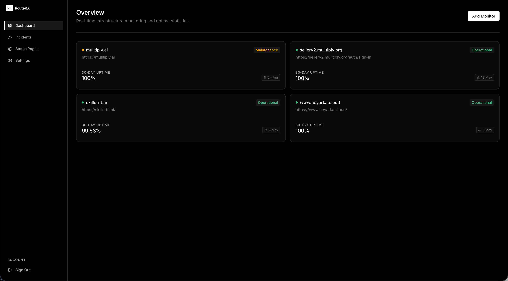
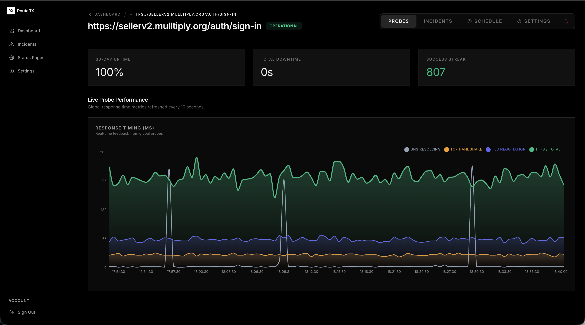
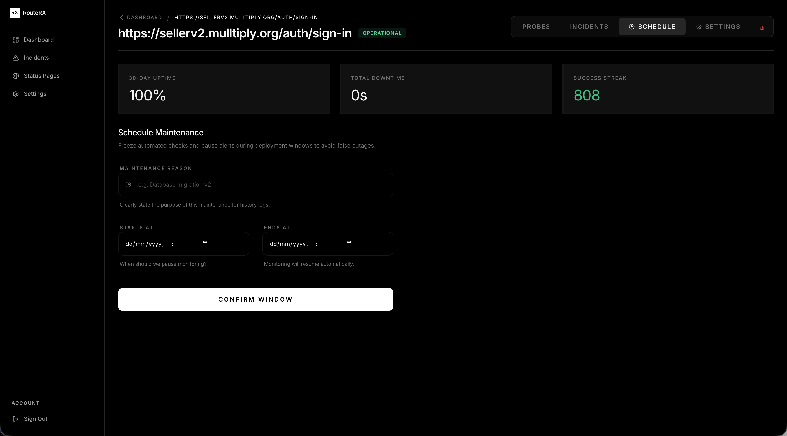
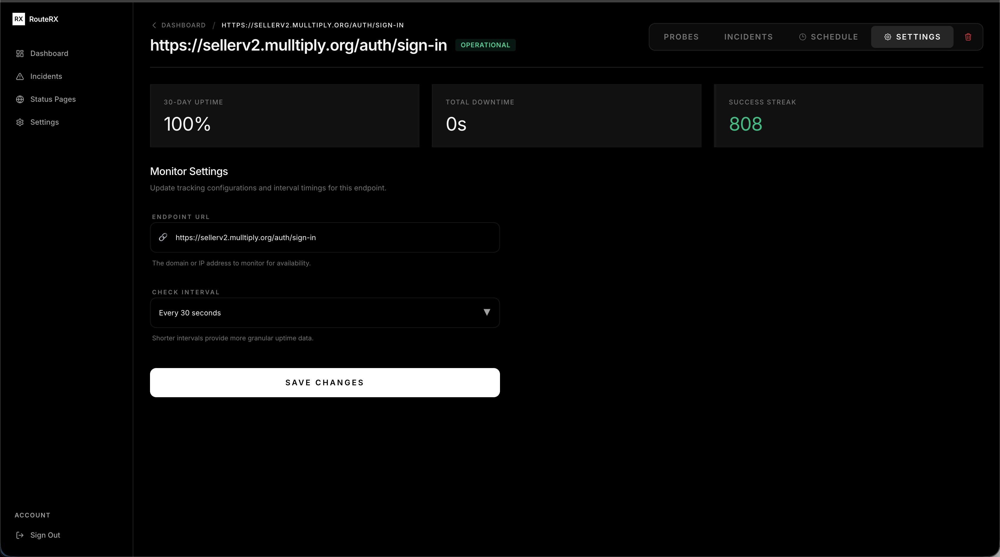
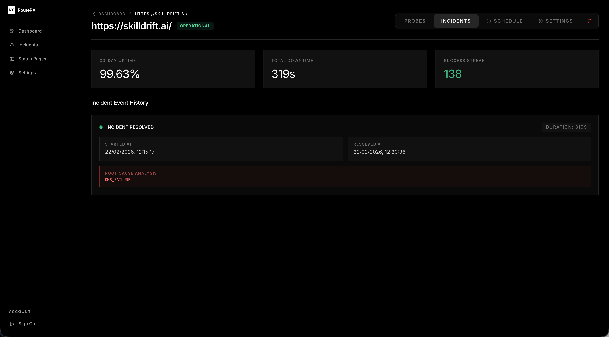
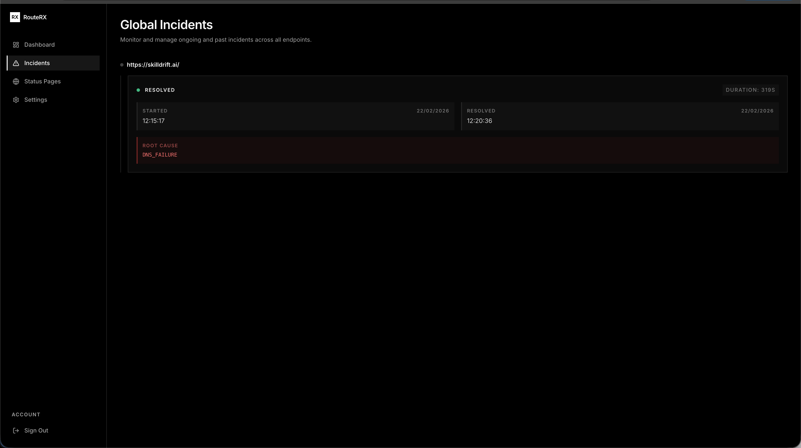
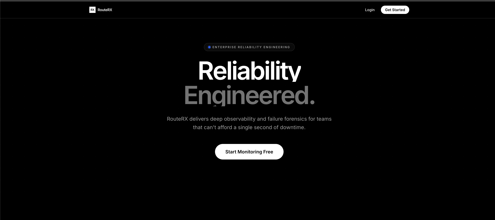
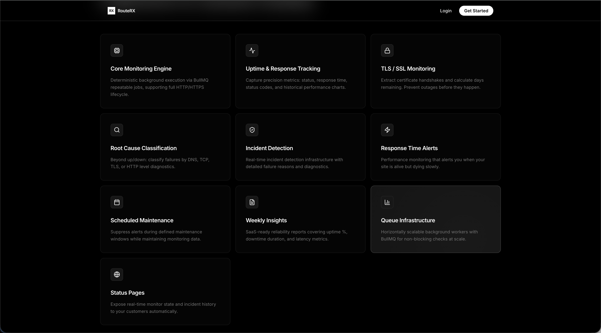

<div align="center">
  

  # ⚡ RouteRX
  
  **Proactive Reliability Monitoring & Incident Detection**

  <p>
    <em>Distributed uptime monitoring, advanced failure forensics, and intelligent outage alerting built for modern infrastructure.</em>
  </p>

  <p>
    <a href="https://routerx.heyarka.cloud/"><strong>🌐 Live Demo</strong></a> ·
    <a href="https://github.com/Arka90/routerx-web"><strong>🖥️ Frontend Repository</strong></a> ·
    <a href="#-getting-started"><strong>🚀 Getting Started</strong></a>
  </p>
</div>

---

## 🚀 Overview

**RouteRX** is a production-grade observability platform designed to monitor web services, detect failures in real-time, classify root causes, and notify your team *before* users encounter an issue.

Unlike basic uptime checkers that merely ping a server to check if a site is "up" or "down", RouteRX conducts deep network layers analysis to understand exactly **why** a service failed.

### ❓ The Problem We Solve

Modern systems rarely "just go down". Failures are usually nuanced and layered:
- Misconfigured DNS records
- Expiring SSL certificates
- Unresponsive upstream dependencies
- Degraded TLS handshakes
- High latency and partial outages

While legacy monitoring tools report a binary `❌ Site is down`, RouteRX provides actionable intelligence:
- `🔍 DNS resolution failed`
- `🔍 TLS certificate expires in 3 days`
- `🔍 TCP handshake timeout`
- `🔍 High TTFB latency spike`

This deep-dive forensic capability allows engineers to proactively remediate issues.

---

## 📸 Platform Previews

Take a look at the beautifully designed React dashboard built to manage and monitor seamlessly:

<details>
<summary><b>Click to expand and view screenshots</b></summary>
<br>


<br><br>

<br><br>

<br><br>

<br><br>

<br><br>

<br><br>

<br><br>


</details>

---

## 🧠 System Architecture

RouteRX operates as a **distributed background-processing system** composed of independent, highly decoupled services. The UI is simply a presentation layer into the true product: a highly available monitoring engine.

```text
User Dashboard (React + Vite)
        ↓
API Layer (Node.js)
        ↓
PostgreSQL (State, History & Time-Series Data)
        ↓
Redis Queue (BullMQ)
        ↓
Background Workers (Monitoring Engine)
        ↓
External Websites (HTTP/TCP/TLS Probes)
```

### 🧩 Core Components

#### 1️⃣ Monitoring Scheduler
Handles reliable execution of repeated jobs. Each monitor generates a BullMQ job with configurable intervals (30s, 1m, 5m), relying on idempotent execution keys and safe restart capabilities to guarantee continuity even if the API server crashes.

#### 2️⃣ Probe Worker (The Engine)
Operates independently from the web layer. Each worker executes a complete network diagnostic trace:
1. **DNS Resolution:** Timing the domain name lookup
2. **TCP Connection:** Measuring establishing connection latency 
3. **TLS Handshake:** Validating secure channel negotiation
4. **HTTP Request:** Fetching and timing network packets
5. **Response Analysis:** Timing Time To First Byte (TTFB) and full transfer

#### 3️⃣ Root Cause Classification Engine
Differentiates between various failures to identify actual root causes intelligently:

| Failure Type | Description |
| :--- | :--- |
| `DNS_FAILURE` | Domain name fails to resolve |
| `TCP_CONNECTION_FAILED` | Destination server is completely unreachable |
| `TLS_HANDSHAKE_FAILED` | Certificate expired, invalid, or HTTPS misconfigured |
| `HTTP_5XX` / `HTTP_4XX` | Server returned an unexpected status code |
| `ASSERTION_FAILED` | Status was fine but the response body was not |
| `SLOW_RESPONSE` | Responding, but above the monitor's latency threshold |
| `TIMEOUT` | Server response exceeded the monitor's timeout |
| `REDIRECT_LOOP` | Still redirecting after five hops |
| `BLOCKED_TARGET` | Resolved to a private or reserved address and was refused |

#### 4️⃣ Incident Detection & Deduplication
Incidents trigger exclusively upon consecutive failure runs. This logic prevents alert storms and false alarms typically caused by minor packet drops, temporary routing hiccups, or container cold starts.

#### 5️⃣ Proactive TLS Monitoring
RouteRX automatically extracts and validates SSL certificate metadata. It actively calculates remaining validity hours to warn you of upcoming expirations or invalid signatures—sidestepping one of the most prominent real-world causes of downtime.

#### 6️⃣ Maintenance Windows
Prevent alerting engineers at 2AM for planned deployments with scheduled routing maintenance which natively suppresses alerts while seamlessly resuming once the window ends.

#### 7️⃣ Multi-Region Confirmation
Checks run from every region you deploy a worker to. A monitor's alert policy
says how many regions must independently agree before an incident opens, so a
routing problem between one probe and your site does not page anybody — and
recovery requires *every* region to be healthy, not just a quorum. See
[docs/MULTI-REGION.md](docs/MULTI-REGION.md).

#### 8️⃣ Public Status Pages
A page per workspace at `/status/<slug>`: 90 days of per-component uptime,
incident history with posted updates, and double-opt-in email subscribers.
Components carry a display name, never the monitor's URL.

#### 9️⃣ Content Assertions
A check is more than "did it return 200". Each monitor carries its own method,
headers, body, expected status codes and an optional body assertion
(`contains`, `not_contains`, or a `json_path` equality), because a page that
returns 200 while rendering an error is the outage that actually catches
people out.

#### 🔟 Team Workspaces
Monitors, alert channels and incidents belong to a workspace. Teammates are
invited by email with an owner, admin or read-only member role. Members can
acknowledge an incident without being able to reconfigure monitoring.

#### 1️⃣1️⃣ Alert Routing
Alerts fan out to email, Slack, Discord, or a signed generic webhook, per
monitor or per workspace. Thresholds, a latency threshold, re-notification
cadence and muting are configured per monitor, and every delivery attempt is
recorded so "why didn't I get paged" has an answer.

---

## 📊 Metrics & Data Analytics

The time-series performance data engine retains comprehensive metrics including:
* **Global Uptime (%)**
* **Granular Downtime Durations**
* **Network Latency & Response Spikes**
* **Success Streak Measurement**
* **Automated Weekly Reliability Reports**

---

## ⚙️ Technology Stack

**Frontend Repository:** [routerx-web](https://github.com/Arka90/routerx-web)
* React 19 + Vite
* TanStack Router & TanStack Query
* TypeScript
* Tailwind with a custom shadcn/ui-derived design
* Recharts for real-time visualisation

**Backend API (This Repository)**
* Node.js & TypeScript
* Domain-Driven Design (Clean Architecture)
* RESTful JSON endpoints

**Infrastructure & Persistence**
* PostgreSQL, through numbered transactional migrations
* Redis + BullMQ for scheduling and workers
* Docker & Docker Compose

Upgrading an existing SQLite deployment? See [docs/UPGRADE.md](docs/UPGRADE.md).

---

## �️ Getting Started

Want to run the complete background processing stack locally?

### Prerequisites
* Docker and Docker Compose
* Node.js v18+

### Quick Start

```bash
# 1. Clone the core API repository
git clone https://github.com/Arka90/routerx-api.git
cd routerx-api

# 2. Set up your local environment variables.
#    DATABASE_URL and JWT_SECRET are required — the process refuses to start
#    without them rather than falling back to a default.
cp .env.example .env

# 3. Spin up dependent infrastructure (PostgreSQL & Redis)
docker compose up -d postgres redis

# 4. Install dependencies and boot the REST server.
#    Migrations are applied before the listener opens.
npm install
npm run dev
```

**Running the tests:**
```bash
npm test
```
No database needed — the suite runs against an in-process Postgres. Set
`TEST_DATABASE_URL` to run the identical suite against a real server, which is
what CI does.

**Starting the Headless Monitoring Engine:**
To start the workers that actually ingest and run probe queries, open a new terminal:
```bash
npm run worker
```

---

## 📌 Roadmap & Future Vision

- [x] Team workspaces with roles and invitations
- [x] Slack, Discord and signed webhook alerting
- [x] Per-monitor alert policies and content assertions
- [x] Public status pages with incident updates and subscribers
- [x] Multi-region probing with quorum confirmation
- [x] Plans, quotas and Stripe billing
- [ ] Status page custom domains
- [ ] A public REST API with scoped keys
- [ ] Advanced anomaly detection via ML
- [ ] Slack/Discord native bot notifications
- [ ] External distributed probe clusters

---

<div align="center">
  <br/>
  <em>Engineered for unparalleled systemic observability and backend reliability.</em>
</div>
